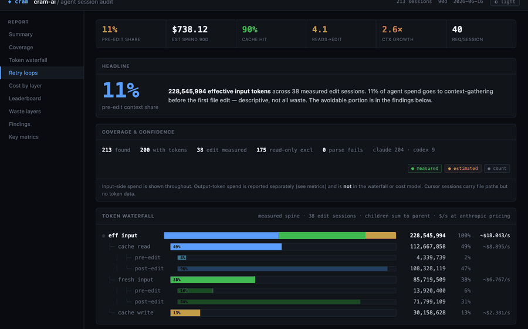
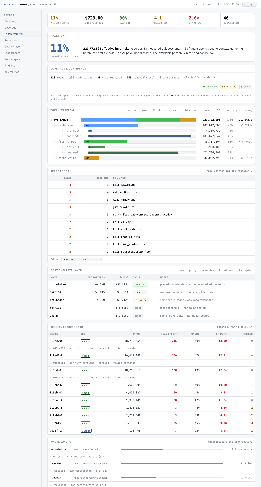

# cram-ai

[](https://pypi.org/project/cram-ai/)
[](https://pypi.org/project/cram-ai/)
[](LICENSE)
[](#try-it-in-10-seconds--no-api-key)

**The profiler and referee for AI coding-agent tokens.**

cram tells you where Claude Code, Cursor, and Codex sessions spend tokens, points at
avoidable waste, and verifies whether an optimization actually helped at equal task
success. It is a profiler first and a referee second: measure the run, name the waste,
then prove whether any proposed fix helped without lowering task success.

Most token tools promise savings. cram asks the useful engineering question:

> Did this reduce token spend without making the agent worse?

It is local-first, transcript-based, and honest about what is measured versus estimated.

## Try it in 10 seconds — no API key

The profiler reads the agent transcripts already on your disk. No signup, no API key, no config:

```bash
pip install cram-ai
cd your-repo
cram audit                 # where did this repo's agent sessions spend tokens?
cram audit --report-html   # same, as a shareable HTML dashboard
```

`cram audit` and every variant (`--report`, `--report-html`, `--session`, `--compare`, `--json`)
are 100% local and deterministic — they never call a model. Only the optional context layer
(`cram task`) uses an LLM.

[`cram audit --report-html`](#html-report) renders the whole audit as one self-contained file:



---

## Why cram exists

AI coding agents do not only spend tokens writing code. They spend a surprising amount of
context on:

- re-discovering the same repo structure every session
- reading the same central files repeatedly before the first edit
- carrying oversized tool outputs through later turns
- retrying failed shell commands or broken test invocations
- stuffing stale or excessive context into long agent loops

cram gives that waste a profile.

| What you want to know | cram command |
|---|---|
| Where did this session's tokens go? | `cram audit --session <id>` |
| Which sessions are wasting orientation tokens? | `cram audit` |
| Which files get re-read across sessions? | `cram audit --report` |
| Want a shareable visual report? | `cram audit --report-html` |
| Did cram context, claude-context, or another optimizer help? | `cram rig ...` |
| Did a real session use fewer tokens after a change? | `cram audit --compare A B` |
| Is optional repo context stale or too large? | `cram status` |

---

## How cram is different

General LLM observability tools show traces, latency, request cost, and app-level quality
signals. cram is narrower: it profiles coding-agent work loops from local transcripts and
explains why an agent spent tokens before making useful progress.

It speaks in developer-native waste classes:

- startup context
- orientation before first edit
- repeated file reads
- oversized tool output carried forward
- retry loops and failed commands
- same-file edit churn
- cache blind spots
- optimizer-on vs optimizer-off

The goal is not only "what did this cost?" It is "why did the agent spend that much, what
would reduce it, and did that fix preserve task success?"

---

## What it does

**1. Profiles real agent transcripts**

`cram audit` reads the transcripts already on your disk and reports orientation cost,
pre-edit context share, context bloat, repeated reads, oversized carried results, retry
loops, edit churn, and cache engagement.

Supported transcript sources today:

| Tool | Reads/edits | Token usage |
|---|---:|---:|
| Claude Code | yes | measured |
| Codex | yes | measured when token usage is present |
| Cursor | yes | no real usage in the transcript; opt-in `--estimate-cursor` adds a clearly-labelled *estimate* from file sizes |

Cursor transcripts carry no token counts, so by default its token metrics show `—`. Pass
`cram audit --estimate-cursor` (or set `CRAM_CURSOR_ESTIMATE=1`) to estimate read-token cost
from the sizes of files each session read. It is always labelled **estimated**, tunable via
`CRAM_CHARS_PER_TOKEN` (default 4), and never mixed into the measured aggregates.

**2. Turns numbers into fixes**

Findings are deterministic rules, not LLM judgment. Examples:

| Finding | Evidence | Likely fix |
|---|---|---|
| Repeated cross-session reads | same files read in many sessions | put durable context in repo briefing |
| Oversized carried result | large tool output re-read by later turns | cap command output |
| Cache blind session | cache write without cache read | stabilize prefix / fix cache config |
| Retry loop | failed commands or repeated same-file edits | record gotcha / improve task recipe |
| Context growth | late turns keep paying for old output | trim results / tune compaction |

**3. Referees optimizers**

`cram rig` compares token usage at fixed success. If an optimization saves tokens by failing
the task, cram does not count that as a win. It can test cram's own context layer, a third-party
optimizer, or no optimizer at all.

**4. Offers an optional repo context layer**

cram can maintain a small `.ai-context/` directory with:

- `ARCHITECTURE.md`: generated repo map
- `SYMBOLS.md`: deterministic file-to-symbol index
- `DECISIONS.md`: architectural decisions humans want agents to remember
- `GOTCHAS.md`: non-obvious traps that grep cannot reveal
- `CURRENT_TASK.md`: focused excerpts for the current task

Agents can load that context through MCP (`get_context()`) or file-based startup rules
(`cram task "..." --target codex`, `--target cursor`, etc.).

This layer is experimental as a token-saving mechanism. Use it when audits show repeated
re-discovery or when you have durable human knowledge to share with agents; verify it with
`cram rig` or `cram audit --compare` before treating it as a win.

---

## Evidence so far

cram ships a reproducible case study against `pallets/click` — full per-session tables in
[CASE_STUDY.md](CASE_STUDY.md), method in [docs/CASE_STUDY_RUNBOOK.md](docs/CASE_STUDY_RUNBOOK.md).

The honest result is **not** "cram context always saves tokens" — it doesn't. The result is that
cram shows **exactly when** an optimization helped, did nothing, or made the run worse. Across the
runs measured, the auto-generated context layer helped on **one** localized Claude bug (−44%
requests at 3/3 success) and was **neutral-to-negative everywhere else** — including a controlled
`cram rig` run where it "saved" tokens but failed more of the task, and so **lost on pass rate**,
which comes first. (The manual `DECISIONS.md` / `GOTCHAS.md` knowledge path is a separate, still
untested claim.)

**Bottom line:** lead with the **audit + referee**; treat the context layer as optional and
unproven for auto-orientation. It's most plausible on unfamiliar repos, natural-language bug
reports where the file isn't obvious, and long-running / repeated / multi-agent loops — and
weakest on tiny edits or prompts that already name the file. The numbers behind all of this,
including the losses, are in [CASE_STUDY.md](CASE_STUDY.md).

---

## Install

```bash
# Standard install with MCP support
pip install 'cram-ai[mcp]'

# Extra provider support through LiteLLM
pip install 'cram-ai[mcp,multi-provider]'
```

Requires Python 3.10+.

---

## Quick start

Start with audit. It is local and does not require model calls.

```bash
cd your-repo
cram audit
cram audit --report
```

Then verify changes with the referee. A controlled corpus compares optimizers only among runs
that still pass the task oracle:

```bash
cram rig <corpus.json> --providers baseline,cram --dry-run
cram rig <corpus.json> --providers baseline,cram
```

For real before/after sessions:

```bash
cram audit --compare ../before ../after
```

If the audit shows repeated re-discovery, or you have durable project knowledge agents keep
missing, you can try the optional context layer:

```bash
cram init
cram status
```

`cram init` gives the agent an immediate repo briefing by generating
`.ai-context/ARCHITECTURE.md`: a concise map of the project structure, stack, key modules,
and entry points. It also builds `SYMBOLS.md`, a deterministic file-to-symbol index used to
pick focused task excerpts.

Fill in the files that matter most:

```bash
vim .ai-context/DECISIONS.md
vim .ai-context/GOTCHAS.md
```

Then use one of the delivery paths.

**MCP path**: configure the `cram mcp` server in your agent and have the agent call:

```text
get_context("fix the rate limiter")
```

**File-based path**: write context into a file your agent reads at startup:

```bash
cram task "fix the rate limiter" --target codex
cram task "fix the rate limiter" --target cursor
cram task "fix the rate limiter" --target claude
```

After a few sessions, measure again. Keep it only if it earns its keep:

```bash
cram audit
cram audit --compare ../my-repo-before-cram ../my-repo-after-cram
```

`--compare` expects two repo checkouts: for example, one checkout before adopting cram
context and another checkout after adopting it. It prints both audits side by side with
deltas, so you can see whether the change moved the numbers.

---

## Session audit

`cram audit` answers: how much work happened before the first edit, how much context was
carried forward, and which patterns look avoidable?

```bash
cram audit                         # last 30 days for this repo
cram audit --days 7                # narrower window
cram audit --all                   # all known projects
cram audit --json                  # machine-readable output
cram audit --report [FILE]         # shareable markdown
cram audit --report-html [FILE]    # standalone HTML report (opens in your browser)
cram audit --layer NAME            # drill into one waste class (orientation, repeated, ...)
cram audit --compare PATH_A PATH_B # compare two repo checkouts side by side
cram audit --reingest              # ignore cache and re-parse
```

Typical output includes:

```text
Avg reads before first edit:    8.2
Avg edits/session:              3.1
Avg read-to-edit ratio:         2.6x
Cache engagement:               18/24 sessions read from cache

Pre-edit context share (measured):
  Edit sessions:                16/24
  Pre-edit context share:       31% of 1,580,000 eff. input tokens
  Pre-edit spend/session:       ~41,200 eff. tokens
```

The audit is deliberately conservative:

- no-edit sessions are excluded from the headline pre-edit share
- sessions without token usage are counted as unmeasured
- output tokens are not included in input-side spend
- dollar attribution is provider-configurable and labeled as an estimate
- file attribution for Codex is limited because shell reads are not structured like Claude/Cursor tool calls

Parsed transcripts are cached in a local SQLite event store at
`~/.local/share/cram-ai/audit.db` unless `CRAM_AUDIT_DB` is set. The store is only a cache;
transcripts remain the source of truth.

---

## Per-session waterfall

For one session, use:

```bash
cram audit --session <id>
cram audit --session <id> --json
```

This shows each request's input, cache-read, cache-write, output, context delta, and tool
activity. It also attributes waste to concrete causes:

```text
Carried waste:
  cram/audit_events.py: 12,307 tok x 18 later turns = 221,526 carried tok

Redundant re-reads: 2x cram/audit_events.py
Failed tool calls: 1
```

Use this when an aggregate finding is too abstract and you need the exact turn or file that
caused the cost.

### Layer drilldown

To expand one waste class into its concrete contributors across sessions:

```bash
cram audit --layer orientation   # sessions with the most reads before first edit
cram audit --layer repeated      # files re-read across sessions (briefing candidates)
cram audit --layer redundant     # files re-read within a session
cram audit --layer carried       # sessions carrying oversized tool output
cram audit --layer retries       # sessions with failed tool calls
cram audit --layer churn         # files re-edited within a session
```

Each lists the worst offenders (files or sessions), so you can go from "context bloat is high"
to the exact files/sessions causing it. Add `--json` for structured output.

---

## Verify optimizers with `cram rig`

`cram rig` is the referee. It compares token usage only among runs that still pass a success
oracle.


An "optimization" that saves tokens by failing the task is not a win — the referee reports
tokens **at fixed success**, so a cheap-but-broken arm is never credited. (Reproduce the clip
above with `python scripts/demo/referee_demo.py`.)

```bash
cram rig <corpus.json> --providers baseline,cram,claude-context
cram rig <corpus.json> --repeats 3 --tier small   # N runs/cell, one tier
cram rig <corpus.json> --dry-run
cram rig <corpus.json> --runner codex
cram rig --observe cram --days 30
cram rig --leaderboard 'examples/rig/bench/results/*.json'
```

A self-contained, tiered benchmark ships in [`examples/rig/bench/`](examples/rig/bench) —
`cram-bench-v1`, small/medium/large tasks that ship red, no external repo to clone. Run it,
commit the result JSON, and render a ranked leaderboard with `--leaderboard`. `--repeats N`
runs each cell N times so the summary reports variance.

Modes:

| Mode | What it means |
|---|---|
| Controlled | fixed corpus, fixture repo, success command, token comparison at equal success |
| Observational | split real sessions by whether the optimizer was used; useful signal, not proof |

Providers:

| Provider | Status |
|---|---|
| `baseline` | no optimizer |
| `cram` | cram context layer |
| `claude-context` | third-party semantic code-search MCP |
| `headroom`, `context-mode` | stubs that report what wiring is missing |

Runners (controlled mode — pick with `--runner`):

| Runner | Agent | Notes |
|---|---|---|
| `claude` (default) | Claude Code headless (`claude -p`) | reuses your Claude login |
| `codex` | Codex noninteractive (`codex exec`) | reuses your Codex login; routes the `cram` provider through `AGENTS.md` |

Both reuse the existing CLI login (no API key). More agent runners can be added behind the same
corpus/oracle interface.

---

## HTML report

```bash
cram audit --report-html        # writes ./cram-audit-report.html and opens it
cram audit --report-html FILE   # write to a specific path
cram audit --report-html --no-open
```

A single self-contained HTML file — inline CSS/JS, no external fonts or fetches — so it
travels: open it locally, attach it to a PR, drop it in Slack. A restrained dark data
dashboard (think Grafana / GitHub Actions logs, not a frosted-glass AI console) with a
light/dark toggle. It renders:

- a KPI **stat strip** and the pre-edit **headline**
- **coverage & confidence** (sessions found / measured / excluded / parse failures, source mix, measured·estimated·count legend)
- the **token waterfall** with per-component `$`/session
- **retry loops** — the same command failing repeatedly
- **cost by waste layer** ($-ranked, with basis)
- the **session leaderboard** with expandable per-turn drilldowns (carried results, failed commands)
- **waste layers** with collapsible top-contributor lists
- **findings** with fix → verify
- **context on/off** A/B when the window contains both
- **key metrics**

It's built from the same `collect_audit()` data as `cram audit --report`, so it makes no
claim the text report doesn't.



---

## Continuous integration (GitHub Action)

cram ships a GitHub Action that turns an audit into a **sticky pull-request comment** and can
**gate** a PR on the rig referee. Because agent transcripts never exist in a stock CI runner,
the action consumes committed/uploaded JSON (produced by `cram audit --json` /
`cram audit --compare A B --json` / `cram rig --json`) rather than live transcripts.

```yaml
# .github/workflows/cram-audit.yml
name: cram audit
on: pull_request
jobs:
  audit:
    runs-on: ubuntu-latest
    permissions:
      contents: read
      pull-requests: write
    steps:
      - uses: actions/checkout@v4
      - uses: vishbay/cram-ai@v1
        with:
          mode: compare              # compare | report | rig
          file-a: .cram/baseline.json
          file-b: .cram/candidate.json
```

| Mode | Input | Effect |
|---|---|---|
| `compare` | two audit JSONs | posts a token-waste delta table |
| `report` | one `cram audit --json` | posts the markdown audit report |
| `rig` | baseline + candidate `cram rig --json` | **fails the check** if candidate success drops more than `tolerance` |

`cram init --team` drops a starter `cram-audit.yml` (and `cram-sync.yml`) into
`.github/workflows/`. On fork PRs where commenting is blocked, the action falls back to the job
summary. The action is key-free.

---

## Optional: the context layer

Everything above is the core of cram — the **profiler** (`cram audit`) and the **referee**
(`cram rig`), both local and proven on real transcripts. The sections below are an **optional**
add-on: a small repo-context layer cram can maintain and deliver to your agent. It is useful
when audits show repeated re-discovery, but it is **experimental as a token-saving mechanism**
— verify it with `cram rig` or `cram audit --compare` before relying on it (see the case study).

---

## Context layer

The context layer is **optional and experimental as an optimizer**. It is one remediation
among several, not required to use cram. Reach for it when your audit shows repeated
re-discovery, or when agents need durable repo knowledge that is not obvious from code search.
The audit and `cram rig` work without it.

```text
.ai-context/
  ARCHITECTURE.md   generated repo map
  SYMBOLS.md        deterministic symbol index
  DECISIONS.md      manual architectural decisions
  GOTCHAS.md        manual foot-guns and production traps
  CURRENT_TASK.md   generated task-specific context
```

`cram init` creates the directory. `cram sync` refreshes generated files. A post-commit hook
can run sync automatically.

The highest-value files are expected to be the manual ones:

- `DECISIONS.md`: "we use cursor pagination", "never call this API directly"
- `GOTCHAS.md`: "users.email is nullable in prod", "this test needs PYTHONPATH=src"

Those facts are not discoverable from syntax alone, which is why they remain useful even as
models get larger context windows. This curated-knowledge claim is separate from the
auto-orientation claim and should be tested independently on tacit-knowledge tasks.

When `get_context("task")` or `cram task "task"` runs, cram:

1. reads the symbol index
2. asks a cheap context model to pick the most relevant files
3. extracts focused snippets around relevant identifiers
4. writes `CURRENT_TASK.md`

The goal is not to prevent the agent from reading files. The goal is to reduce blind
re-discovery and preload durable project knowledge. Treat the generated briefing and excerpts
as a candidate fix, not a guaranteed savings layer.

---

## MCP delivery

For MCP-capable tools, configure one server:

```json
{
  "mcpServers": {
    "cram-ai": {
      "command": "cram",
      "args": ["mcp", "--repo", "/absolute/path/to/your-repo"]
    }
  }
}
```

Use your client's native MCP config location. Claude Code, Cursor, Windsurf, Zed, and Codex
CLI all have MCP support, but their config filenames and formats can differ by version.

Available MCP tools:

| Tool | What it does |
|---|---|
| `get_context(task='')` | Builds or reloads focused task context |
| `get_architecture()` | Returns `ARCHITECTURE.md` |
| `get_symbols(query='')` | Returns or filters `SYMBOLS.md` |
| `get_decisions()` | Returns `DECISIONS.md` |
| `get_gotchas()` | Returns `GOTCHAS.md` |
| `add_file(path, identifiers='')` | Adds focused excerpts from a file |
| `get_health()` | Reports staleness and token budgets |
| `get_task_history(limit=20)` | Shows recent task contexts |
| `propose_decision(...)` | Adds a pending decision for human review |
| `run_benchmark()` | Models context delivery costs |

Recommended agent instruction:

```text
Call get_context("<task>") before starting work, and call it again when the task changes.
```

---

## File-based delivery

For tools that read instruction files at startup:

```bash
cram task "add pagination to the users endpoint" --target codex
cram task "add pagination to the users endpoint" --target cursor
cram task "add pagination to the users endpoint" --target all
```

Built-in targets:

| Target | File |
|---|---|
| `codex` | `AGENTS.md` |
| `claude` | `CLAUDE.md` |
| `cursor` | `.cursor/rules/cram-task.md` |
| `windsurf` | `.windsurf/rules/cram-task.md` |
| `copilot` | `.github/cram-task.md` |
| `gemini` | `GEMINI.md` |
| `all` | all detected targets |

Custom targets live in `.ai-context/config.toml`:

```toml
[targets.acme]
file = "ACME.md"
indicator = "acme.config.json"
upsert = true
```

Every file-based target includes command-output protection rules so agents do not accidentally
carry huge shell output through the rest of a session.

---

## Concurrency and team

These are two different things; cram supports one today and not the other.

- **Concurrent agents on one repo — supported now.** Each `get_context("task")` / `cram task`
  call writes its own slot file under `.ai-context/tasks/<task>.md`, so multiple agents working
  the same repo at once never overwrite each other's task context. The shared files
  (`ARCHITECTURE.md`, `DECISIONS.md`, `GOTCHAS.md`, `SYMBOLS.md`) are read-mostly and committed,
  so teammates get the same context layer through normal version control.
- **Hosted, multi-developer "team" features — not built yet.** Shared dashboards and
  cross-developer audit rollups may come later around the open core. Today cram runs on a
  single developer's machine.

In short: concurrent agents, yes; centralized team analytics, not yet.

---

## Context health

Context can go stale. cram tracks this with a 0-10 staleness score based on commits since the
generated context was last refreshed, mapped to a band:

| Score | Band | Meaning |
|---:|---|---|
| 0-2 | fresh | context tracks the code |
| 3-5 | acceptable | minor drift |
| 6-7 | stale | refresh recommended (`cram sync`) |
| 8-10 | critical | likely misleading; refresh before relying on it |

Only commits that change repo *structure* count against `ARCHITECTURE.md`: a content-only
commit leaves it fresh by design, so the score does not creep on every commit.

```bash
cram status
cram sync
```

Health surfaces in:

- `cram status`
- `get_health()`
- `get_context()` warnings when context is stale or critical

Soft budgets warn but do not truncate:

| File | Default budget | Override |
|---|---:|---|
| `ARCHITECTURE.md` | 3,000 tok | `CRAM_BUDGET_ARCHITECTURE` |
| `DECISIONS.md` | 1,800 tok | `CRAM_BUDGET_DECISIONS` |
| `GOTCHAS.md` | 800 tok | `CRAM_BUDGET_GOTCHAS` |
| `CURRENT_TASK.md` | 2,000 tok | `CRAM_BUDGET_TASK` |
| `SYMBOLS.md` | none | scales with repo size |

---

## Model providers

The audit path is local and does not call a model. The context layer does call a configured
context model to generate `ARCHITECTURE.md`, mine decisions, and select files for a task.

**Subscription or API key?** If you have a Claude or Codex subscription, cram uses your
existing CLI login (`claude` / `codex`) — no API key required. API keys are only needed for
the direct-API providers (Anthropic/OpenAI/Gemini) or hosted gateways below.

Auto-discovery currently checks:

- Claude CLI
- Codex CLI
- Ollama
- LM Studio
- AWS Bedrock
- GCP Vertex AI
- Azure OpenAI
- direct Anthropic/OpenAI/Gemini API keys
- a custom proxy

To force a CLI preference in auto mode:

```bash
export CRAM_CONTEXT_PROVIDER=codex
# or
export CRAM_CONTEXT_PROVIDER=claude
```

To set an explicit context model, edit `~/.config/cram-ai/settings.json`:

```json
{
  "context_model": "codex-cli/default"
}
```

Other examples:

```json
{ "context_model": "cli/haiku" }
{ "context_model": "openai/gpt-4o-mini" }
{ "context_model": "gemini/gemini-2.0-flash" }
{ "context_model": "ollama/mistral" }
{ "context_model": "lmstudio/my-local-model" }
```

For enterprise gateways:

```json
{
  "proxy": {
    "base_url": "https://gateway.corp/v1",
    "headers": { "X-Corp-Token": "your-sso-token" }
  },
  "context_model": "proxy/custom"
}
```

Privacy note: `cram audit` stays local. `cram init`, `cram sync`, `cram decisions --mine`,
and `cram task` can send repo summaries or code excerpts to your configured context model.

---

## Commands

| Command | Purpose |
|---|---|
| `cram audit` | Profile agent sessions |
| `cram audit --session <id>` | Inspect one session's token waterfall |
| `cram audit --layer <name>` | Drill into one waste class (orientation/repeated/redundant/carried/retries/churn) |
| `cram audit --report [FILE]` | Write a shareable markdown report |
| `cram audit --report-html [FILE]` | Write a standalone HTML report (opens in your browser) |
| `cram audit --compare A B` | Compare two checkouts |
| `cram init` | Create `.ai-context/` |
| `cram task "..."` | Build task context |
| `cram add <file>` | Add a file to current task context |
| `cram sync` | Refresh generated context |
| `cram continue` | Extend the task grace period before a commit resets context |
| `cram status` | Check freshness and budgets |
| `cram decide "..."` | Add a decision |
| `cram gotcha "..."` | Add a gotcha |
| `cram decisions --mine` | Mine git history for decision candidates |
| `cram benchmark` | Estimate token savings vs full-repo auto-indexing |
| `cram rig ...` | Verify optimizers |
| `cram mcp` | Start the MCP server |
| `cram hook install\|uninstall` | Manage the git post-commit sync hook |
| `cram doctor` | Check setup |

---

## Environment variables

| Variable | Default | Description |
|---|---|---|
| `CRAM_CONTEXT_PROVIDER` | auto | Prefer `codex` or `claude` CLI in auto context-model selection |
| `CRAM_PROVIDER` | `anthropic` | Pricing table for audit dollar attribution |
| `CRAM_AUDIT_DB` | `~/.local/share/cram-ai/audit.db` | Audit cache path; `:memory:` accepted |
| `CRAM_PRICE_INPUT_PER_MTOK` | provider default | Override input price for cost estimates |
| `CRAM_CACHE_WRITE_MULT` | provider default | Override cache-write multiplier |
| `CRAM_CACHE_READ_MULT` | provider default | Override cache-read multiplier |
| `CRAM_AUDIT_TOK_PER_FILE` | `2500` | Tokens assumed per orientation file read in older cost modeling |
| `CRAM_AUDIT_BIG_RESULT_BYTES` | `20000` | Threshold for oversized tool result findings |
| `AICONTEXT_MAX_FILES` | `5` | Max files in task context |
| `AICONTEXT_MAX_LINES` | `300` | Max excerpt lines per file |
| `CRAM_TASK_GRACE_SECONDS` | `600` | Grace period before commit resets task context |
| `CRAM_STALE_CRITICAL_COMMITS` | `10` | Commits that map to critical staleness |
| `CRAM_BUDGET_ARCHITECTURE` | `3000` | Soft token budget |
| `CRAM_BUDGET_DECISIONS` | `1800` | Soft token budget |
| `CRAM_BUDGET_GOTCHAS` | `800` | Soft token budget |
| `CRAM_BUDGET_TASK` | `2000` | Soft token budget |

`AICONTEXT_MODEL` is still supported by the older `call_model()` fallback path, but explicit
context-model routing should use `~/.config/cram-ai/settings.json`.

---

## What cram is not

cram is not an automatic universal token reducer.

It will not magically make every agent run cheaper. It gives you measurements, points at
avoidable patterns, and lets you verify whether cram's optional context layer, a third-party
optimizer, or a config change actually helped.

That is the product boundary: profiler and referee first; context memory is optional and must
be measured.

---

## Contributing

Issues and PRs are welcome.

```bash
pip install -e '.[mcp]' pytest
pytest
```

No API key is required for tests; model calls are mocked.

Audit-metric changes should be additive and clearly labeled as measured or estimated.

---

## License

Apache-2.0. See [LICENSE](LICENSE).

cram is open source and local-first. The local single-developer workflow — audit, event
store, audit CLI, findings, context layer, and markdown reports — is open source. (Concurrent agents on
one repo are supported today; see [Concurrency and team](#concurrency-and-team).)
